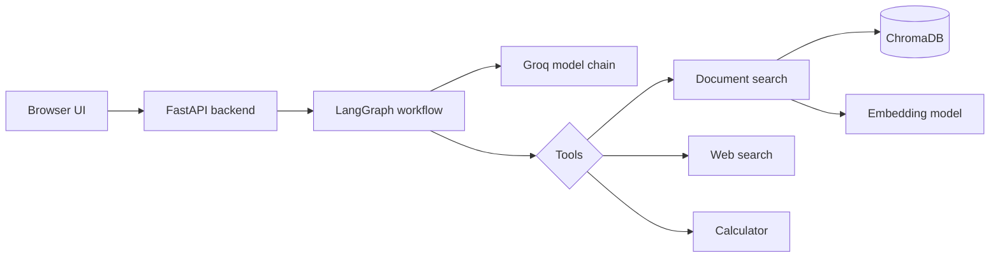

# Personal AI Assistant

A practical AI app for document-grounded chat, tool use, and real-time responses.

## What this project does

This project gives you a chat assistant that can:

- hold multiple conversation threads in the browser
- answer questions from uploaded documents
- search the web for current or external info
- use a calculator for numeric work
- stream replies live while the model is generating
- keep document memory isolated per browser session

## System design

<div align="center">
  
</div>

## Why it’s useful

- document-first answers when files are uploaded
- strong retrieval flow with reranking and filtering
- browser-scoped RAG memory via `kb_id`
- LangGraph orchestration for tool calls and validation
- clean full-stack setup with a lightweight frontend

## Architecture overview



## Project structure

```text
fastapi-chat-app/
├── main.py
├── chat_app_backend.py
├── chat_app_backend_rag.py
├── llm_router.py
├── prompts.py
├── tools.py
├── requirements.txt
├── pyproject.toml
├── Dockerfile
├── compose.yaml
├── .env
├── static/
│   ├── index.html
│   ├── app.js
│   └── style.css
├── src/
│   ├── System Design.png
│   └── ...
├── vectorstore/
├── eval_files/
├── .uploaded_files/
└── README.md
```

## Core components

### Backend

- `main.py` handles the FastAPI routes, upload flow, and streaming responses.
- `chat_app_backend.py` contains the LangGraph flow and the self-check logic.
- `chat_app_backend_rag.py` handles document loading, embeddings, retrieval, reranking, and context generation.
- `llm_router.py` manages the fallback model chain.
- `prompts.py` defines the system prompt and document-priority rules.
- `tools.py` defines the available tools: RAG, web search, and calculator.

### Frontend

- `static/index.html` builds the UI shell
- `static/app.js` handles chat state, thread management, uploads, and SSE rendering
- `static/style.css` handles the app styling and layout

## How the app works

### Chat path

1. The browser sends a message and thread info to the backend.
2. FastAPI starts the LangGraph stream.
3. The model decides whether it needs a tool.
4. If a tool is needed, the graph executes it and loops back.
5. If not, the answer is validated before being sent back to the user.
6. The frontend renders the response live as tokens arrive.

### RAG path

1. A user uploads supported files.
2. The backend splits and stores those documents in a browser-specific Chroma collection.
3. The user asks a question.
4. The query is expanded and retrieved.
5. Relevant chunks are reranked and prioritized.
6. The strongest context is assembled and sent to the model.

## Tech stack

| Area | Stack |
| --- | --- |
| Backend | FastAPI, Uvicorn |
| Agent workflow | LangGraph, LangChain |
| LLM provider | Groq via `langchain-groq` |
| Retrieval | ChromaDB, Hugging Face embeddings |
| Parsing | PyPDF, Docx2txt, TextLoader |
| Frontend | HTML, CSS, JavaScript |
| Rendering | marked.js, KaTeX, highlight.js |
| Math | SymPy |

## Quick start

### Prerequisites

- Python 3.10+
- Groq API key
- optional: Docker if you want a containerized run

### Install

```bash
pip install -r requirements.txt
```

### Environment

Create a `.env` file in the project root:

```env
GROQ_API_KEY=your_key_here
```

### Run locally

```bash
uvicorn main:app --reload
```

Then open:

```text
http://localhost:8000
```

### Docker

```bash
docker compose up --build
```

## Notes

This project is built to stay readable and practical. The app is intentionally not overbuilt: it keeps the retrieval flow, tool orchestration, and browser isolation easy to reason about while still giving you a working AI product.

## License

This project is intended for learning, experimentation, and portfolio use. If you plan to distribute it publicly, add a license file first.


The browser creates a unique `kb_id`, and that ID becomes the ChromaDB collection name used by the RAG tool. This gives each browser session an isolated document namespace without requiring a full authentication system for the prototype.

## Current Scope and Next Improvements

This project is intentionally focused on the core AI application experience. The current graph uses an in-memory LangGraph checkpointer, so active conversations are lost when the backend process restarts; the browser detects and removes stale thread entries after a restart. Natural next steps include authenticated users, durable checkpoint storage, background document indexing, streaming upload progress, automated tests, and observability with tracing and metrics.

## License

This project is available for learning and portfolio demonstration. Add a license file before distributing it publicly.
